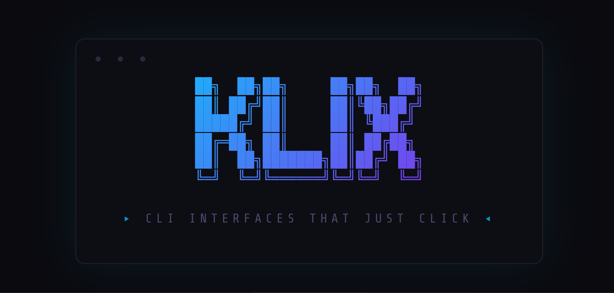
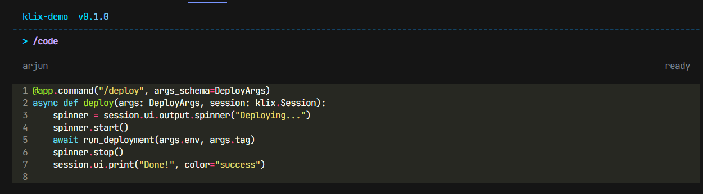
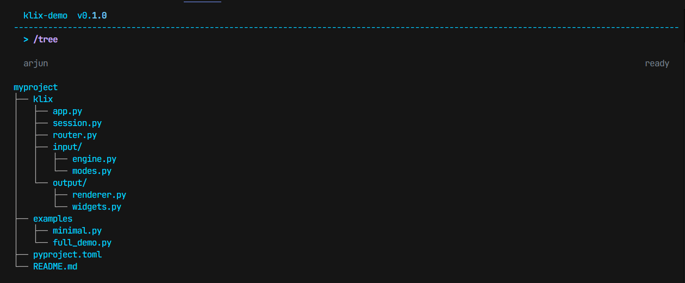
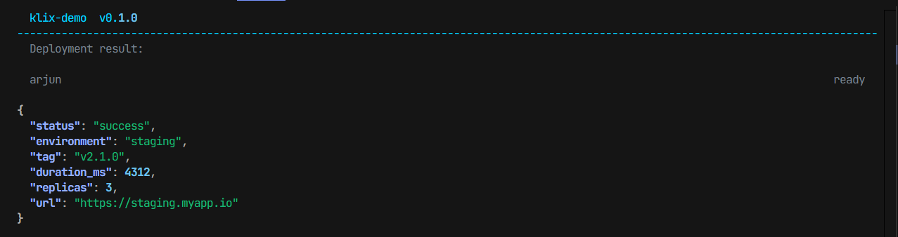
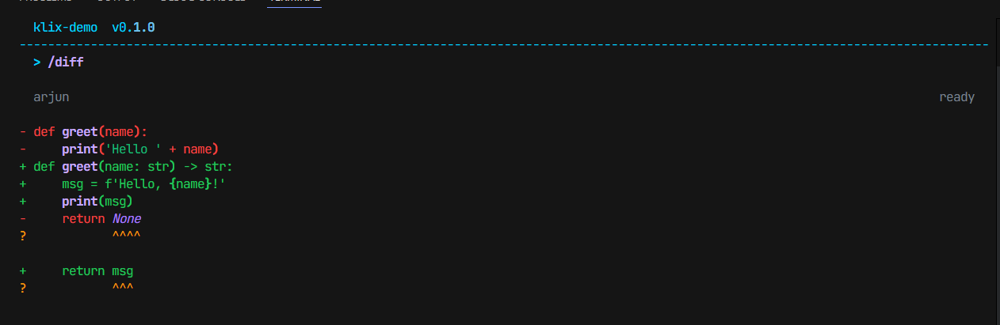
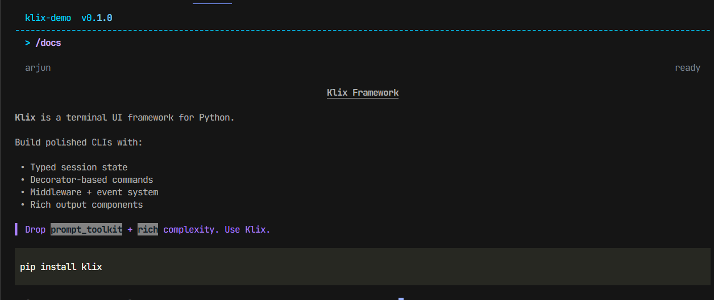

# Klix

*CLI interfaces that just click.*



Klix is a Python framework for building polished, interactive command-line applications. It combines command routing, typed session state, prompt-driven input, rich rendering, middleware, events, and lightweight layout primitives into one developer-facing toolkit.

<details>
<summary><b>View UI Gallery</b></summary>

### Help Generation


### Interactive Select


### Error Handling


### Syntax Highlighting


### Tree & JSON Views



### Diff View


### Markdown Rendering


</details>

## Why Klix

Klix is built for developers who want more than `print()` and `argparse`, but do not want to hand-roll a terminal framework every time they start a new tool.

It is a framework, not a finished app. You define the commands, state, UI, and flow. Klix provides the runtime pieces that make those tools feel deliberate instead of improvised.

## Key Features

- Command-first app model with decorators and first-class `Command` objects
- Typed session state for per-run data and persisted workflows
- Prompt-driven input powered by `prompt_toolkit`
- Rich terminal rendering with sensible fallback behavior
- Reusable UI helpers for tables, panels, spinners, selectors, forms, and streaming
- Middleware and lifecycle events for cross-cutting behavior
- Lightweight layout regions for headers, status lines, and structured screens
- Built-in scaffold CLI via `klix init mytool`

## Demo

Minimal command flow:

```text
$ python examples/minimal.py
Minimal
Try /help, /deploy staging, /ask, /login, /markdown, or /exit.

> /deploy staging --force
Deploying to staging in forced mode

> /help
/deploy <environment> [--force]      Deploy to an environment
/ask                                 Prompt for free-form input
/login                               Collect credentials interactively
/markdown                            Render markdown output

> /exit
```

Chat-style UI example:

```text
$ python examples/chat_ai.py
Klix Assistant
Talk to the demo like a ai chat app. Type normal text to send a message...

You > explain terminal UX
Assistant: terminal UX looks manageable. I would break it into a small core...

You > /theme
Assistant: Theme switched to light.
```

## Installation

From PyPI:

```bash
pip install klix
```

For local development:

```bash
python -m pip install -e .
```

This installs:

- the `klix` Python package
- the `klix` scaffold command

After installation:

```bash
klix
```

Expected output:

```text
Usage: klix init <name>
```

## Quickstart

Create a small Klix app:

```python
from dataclasses import dataclass

import klix


@dataclass
class DemoState(klix.SessionState):
    runs: int = 0


app = klix.App(
    name="demo",
    version="0.1.0",
    description="Small Klix example",
    state_schema=DemoState,
)


@app.on("start")
def on_start(session: klix.Session) -> None:
    session.ui.print("Demo is ready. Try /hello or /exit.", color="muted")


@app.command("/hello", help="Say hello")
def hello(session: klix.Session) -> None:
    session.state.runs += 1
    session.ui.print(f"Hello from Klix. Run #{session.state.runs}", color="success")


if __name__ == "__main__":
    app.run()
```

Run it:

```bash
python main.py
```

## Core Concepts

- `App`: the composition root for commands, middleware, events, theme, and persistence
- `Session`: per-run context holding state, metadata, UI, and input history
- `Router`: parses slash commands and validates typed arguments
- `InputEngine`: prompt handling, input modes, and interactive terminal behavior
- `Renderer`: rich-aware output with fallback modes for simpler terminals
- `UI`: the main application-facing namespace for input, output, layout, and streaming
- `Layout`: lightweight persistent regions for header, main output, and status

If you want the deeper architectural walkthrough, start with [docs/index.md](docs/index.md) and then [docs/concepts/architecture.md](docs/concepts/architecture.md).

## Example Command Usage

Typed command with arguments:

```python
from pydantic import BaseModel


class DeployArgs(BaseModel):
    environment: str
    force: bool = False


@app.command("/deploy", args_schema=DeployArgs, help="Deploy the service")
def deploy(args: DeployArgs, session: klix.Session) -> None:
    session.ui.print(
        f"Deploying to {args.environment} (force={args.force})",
        color="warning",
    )
```

Interactive command with reusable UI components:

```python
@app.command("/release", help="Run a guided release flow")
async def release(session: klix.Session) -> None:
    version = await session.ui.input.text("Version", placeholder="1.2.3")
    target = await session.ui.input.select(
        ["staging", "production"],
        label="Environment",
    )
    confirmed = await session.ui.input.confirm(
        f"Release {version} to {target}?",
        default=False,
    )

    if not confirmed:
        session.ui.print("Release cancelled.", color="warning")
        return

    session.ui.output.panel(
        f"Released {version} to {target}",
        title="Release Complete",
        border_color="success",
    )
```

## Examples In This Repository

- `examples/minimal.py`: compact command-oriented starter app
- `examples/full_demo.py`: broader framework walkthrough with persistence and middleware
- `examples/chat_ai.py`: Gemini-style conversational UI demo
- `examples/ui_showcase.py`: reusable input and output component showcase

## Documentation

The full docs live in [docs/](docs/).

Recommended starting points:

- [Getting Started](docs/getting-started.md)
- [Installation](docs/installation.md)
- [Quickstart](docs/quickstart.md)
- [Architecture](docs/concepts/architecture.md)
- [Building Your First CLI](docs/guides/building-your-first-cli.md)
- [API Reference](docs/reference/api.md)

## AI Skill

If you are using an AI coding agent, see [SKILL.md](SKILL.md). It is a concise, implementation-aware guide for building Klix apps quickly without reading the full docs set first.

## Contributing

Contributions are welcome. Good issues, focused pull requests, example improvements, and documentation fixes all help.

Start with [CONTRIBUTING.md](CONTRIBUTING.md) for local setup, project structure, and contribution guidelines.

## License

Klix is licensed under the [Apache License 2.0](LICENSE).
