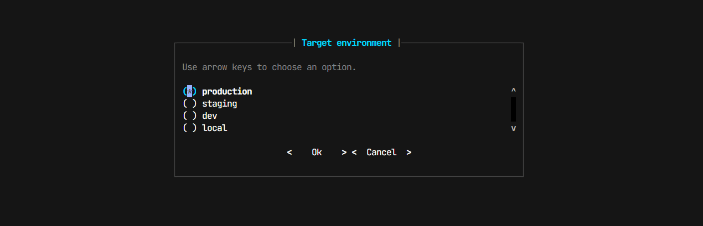

# Input Components

Klix exposes interactive input helpers through `session.ui.input.*`. These components wrap prompt-toolkit so app code can ask for structured input without rebuilding prompt flows every time.

If you need the lower-level prompt engine, see [Input Engine](../concepts/input-engine.md). If you want to understand how the unified UI namespace is assembled, see [UI](../concepts/ui.md).

## What Lives Here

The current input component set includes:

- `text(...)`
- `secret(...)`
- `confirm(...)`
- `select(...)`
- `multiselect(...)`
- `fuzzy(...)`
- `number(...)`
- `toggle(...)`

All of them are available from the same place:

```python
value = await session.ui.input.text("Name")
```

## Text Input

Use this for the common case: prompt the user for a line of text, optionally with a default, placeholder, or validator.

```python
name = await session.ui.input.text(
    "Name",
    placeholder="Jane Doe",
    default="Anonymous",
    validate=lambda value: len(value.strip()) > 0,
)
```

Why use this instead of the raw engine:

- it sets the right prompt mode
- it supports simple validation
- it handles prompt rendering consistently

Pitfall:

- validation is a boolean hook, not a rich error-reporting pipeline. If you need field-by-field feedback, print it yourself and reprompt.

## Password Input

`secret(...)` is the masked input helper.

```python
password = await session.ui.input.secret("Password")
```

Behavior worth knowing:

- input is masked in interactive mode
- the component avoids storing the entry in prompt history
- CI or non-interactive fallback is simpler, because there is no full terminal UI

## Confirm

`confirm(...)` asks a yes/no question and returns `True` or `False`.

```python
approved = await session.ui.input.confirm(
    "Deploy to production?",
    default=False,
)
```

If a default is provided, the prompt reflects it. This is the easiest way to build small approval steps in a command flow.

## Select

`select(...)` provides a single-choice selector with arrow-key navigation and Enter to confirm.

```python
environment = await session.ui.input.select(
    ["staging", "production", "preview"],
    label="Choose an environment",
)
```



Internally this uses prompt-toolkit’s radio-list dialog in interactive terminals.

Pitfalls:

- if the user cancels the dialog, Klix raises `InputCancelledError`
- in CI mode, the interaction model is reduced and may not match the full terminal experience

## Multi-Select

`multiselect(...)` is the checkbox version of `select(...)`.

```python
flags = await session.ui.input.multiselect(
    ["fast", "safe", "cheap", "creative"],
    label="Choose release traits",
    default=["safe"],
)
```

The interactive behavior is:

- arrow keys move the active row
- Space toggles the current option
- Enter confirms

The result is a list of selected values.

## Fuzzy Search

`fuzzy(...)` lets the user type to filter a list and then choose a result.

```python
service = await session.ui.input.fuzzy(
    ["api", "worker", "scheduler", "gateway"],
    label="Find a service",
)
```

This is useful when:

- the option list is long
- prefix matching is not enough
- you want a tighter command flow than a slash argument plus autocomplete

## Number Input

`number(...)` builds on text input and coerces the result to a numeric value.

```python
score = await session.ui.input.number(
    "Score",
    min_val=0,
    max_val=100,
)
```

Use it when you want a simple numeric gate without writing your own parser.

Pitfall:

- the range check is still simple. If you need units, decimals with tighter rules, or domain-specific validation, wrap `text(...)` with your own logic.

## Toggle

`toggle(...)` returns a boolean but presents it as a direct on/off interaction.

```python
enabled = await session.ui.input.toggle("Enable debug mode", default=True)
```

This is mostly a convenience wrapper for cases where a full yes/no sentence is not the best fit.

## A Practical Form Flow

```python
@app.command("/release", help="Collect release inputs")
async def release(session: klix.Session) -> None:
    version = await session.ui.input.text("Version", placeholder="1.2.3")
    environment = await session.ui.input.select(
        ["staging", "production"],
        label="Environment",
    )
    features = await session.ui.input.multiselect(
        ["migrate-db", "warm-cache", "notify-team"],
        label="Release steps",
    )
    approved = await session.ui.input.confirm(
        f"Release {version} to {environment}?",
        default=False,
    )

    session.ui.output.json(
        {
            "version": version,
            "environment": environment,
            "steps": features,
            "approved": approved,
        }
    )
```

## Common Mistakes

- Using raw prompt-engine calls for every field when the high-level components already cover the flow.
- Assuming selection components are part of the persistent layout. They are transient prompt interactions.
- Forgetting to catch `InputCancelledError` when cancellation should be handled cleanly.
- Expecting these components to store complex form state automatically. They return values; your app decides what to do with them.

## Related Reading

- [Components: Widgets](widgets.md)
- [Creating UI](../guides/creating-ui.md)
- [Input Modes](../guides/input-modes.md)
