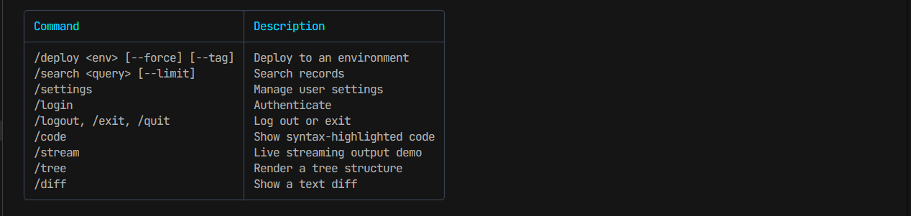

# Adding Commands

Commands are the center of most Klix applications. They define what the CLI can do and how input turns into handler calls.

This guide focuses on practical command design. For the underlying model, see [Commands](../concepts/commands.md). For parsing details, see [Router](../concepts/router.md).

## Start Simple

The smallest command is just a named handler:

```python
@app.command("/status", help="Show current status")
def status(session: klix.Session) -> None:
    session.ui.print("Everything looks healthy.", color="success")
```

Klix registers the function and stores metadata used by:

- command dispatch
- help generation
- autocomplete

## Add Aliases

Aliases are useful when you want a short form or a more discoverable synonym.

```python
@app.command("/deploy", aliases=["/ship"], help="Deploy the current build")
def deploy(session: klix.Session) -> None:
    session.ui.print("Deploy started.", color="warning")
```

Typing `/ship` resolves to the canonical `/deploy` command internally.

Pitfall:

- Avoid alias overlap. If two commands claim the same alias, the later registration wins and the result is confusing.

## Use Typed Arguments

The recommended path is a Pydantic schema.

```python
from pydantic import BaseModel, Field


class InviteArgs(BaseModel):
    email: str = Field(description="User email")
    role: str = Field(default="viewer", description="Assigned role")
    resend: bool = Field(default=False, description="Resend existing invite")


@app.command("/invite", args_schema=InviteArgs, help="Invite a user")
def invite(args: InviteArgs, session: klix.Session) -> None:
    session.ui.print(
        f"Inviting {args.email} as {args.role} (resend={args.resend})",
        color="accent",
    )
```

Example input:

```text
/invite user@example.com --role admin --resend
```

How it works:

1. Klix tokenizes the input.
2. It identifies the command name or alias.
3. It maps positionals to schema fields in declaration order.
4. It maps `--flag value` pairs or bare boolean flags.
5. Pydantic validates and coerces the result.

## Design Commands Around Tasks, Not Internal Objects

Good command shapes:

- `/deploy staging 1.2.3`
- `/user invite someone@example.com --role admin`
- `/logs api --tail 100`

Less useful command shapes:

- `/run-deploy-pipeline`
- `/do-operation-x`
- `/set-flag true`

Klix does not enforce naming style, but task-oriented commands are easier to discover and easier to document.

## Sync vs Async Handlers

Klix supports both:

```python
@app.command("/refresh", help="Run a quick refresh")
def refresh(session: klix.Session) -> None:
    session.ui.print("Refreshed.", color="success")


@app.command("/sync", help="Run a slow sync")
async def sync_cmd(session: klix.Session) -> None:
    session.ui.print("Starting sync...", color="warning")
    await asyncio.sleep(1)
    session.ui.print("Sync complete.", color="success")
```

Use async handlers when the command does real waiting:

- network calls
- timers
- background orchestration
- streaming output

## Emit Rich Output

A command does not have to print plain lines.

```python
@app.command("/report", help="Show a health report")
def report(session: klix.Session) -> None:
    session.ui.output.table(
        headers=["Service", "Status", "Latency"],
        rows=[
            ["api", "healthy", "42ms"],
            ["worker", "healthy", "18ms"],
            ["db", "degraded", "110ms"],
        ],
        header_color="accent",
        alignments=["left", "center", "right"],
    )
```

See [Components: Output](../components/output.md) and [Components: Widgets](../components/widgets.md).

## Handle Errors Deliberately

If a handler raises, the app emits an `error` event and prints an error line through the UI.

For user-facing validation, prefer raising through schema validation or printing a clear message and returning.

```python
@app.command("/remove", help="Remove a deployment")
def remove(session: klix.Session) -> None:
    if not session.state.deploys:
        session.ui.print("No deployments to remove.", color="warning")
        return
```

## Build Nested Flows with Command Families

Klix does not implement subcommand parsing as a first-class system. The common pattern is to model subcommands inside the argument schema.

```python
class UserArgs(BaseModel):
    action: str
    email: str | None = None


@app.command("/user", args_schema=UserArgs, help="User operations")
def user(args: UserArgs, session: klix.Session) -> None:
    if args.action == "list":
        session.ui.print("Listing users...", color="accent")
    elif args.action == "invite" and args.email:
        session.ui.print(f"Inviting {args.email}", color="success")
    else:
        session.ui.print("Usage: /user list | /user invite <email>", color="warning")
```

That keeps the routing layer simple while still giving you expressive command shapes.

## Generate Help

Klix ships a built-in help generator:

```python
@app.command("/help", help="Show commands")
def help_cmd(session: klix.Session) -> None:
    session.ui.output.panel(
        app.generate_help(),
        title="Commands",
        border_color="border",
        title_color="accent",
    )
```



This is the same approach used by the shipped examples.

## Common Mistakes

- Forgetting the leading slash. The standard app loop routes slash commands; plain text is just input.
- Expecting quoted strings with spaces to stay grouped. They do not. The parser is whitespace-based.
- Declaring a schema field order that does not match the natural positional order you want.
- Using aliases that shadow a real command name.
- Treating command handlers as global functions. They should always work against the current `Session`.

## Next Steps

- [Using Middleware](using-middleware.md)
- [Handling Events](handling-events.md)
- [Reference: Commands](../reference/commands.md)
