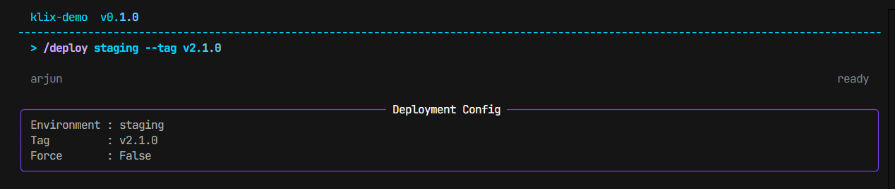

# Building Your First CLI

This guide walks through the smallest useful Klix application and then expands it into something you could actually ship.

If you have not installed the framework yet, start with [Installation](../installation.md). If you want a quicker tour first, read [Quickstart](../quickstart.md).

## What You Are Building

The goal is a CLI that:

- starts with a prompt
- registers a couple of slash commands
- keeps a typed session state object
- prints styled output through the shared UI namespace

Klix is designed so you spend most of your time in three places:

- the `App` definition
- command handlers
- session-aware helpers

See [App](../concepts/app.md), [Commands](../concepts/commands.md), and [Session](../concepts/session.md) for the architectural background.

## Step 1: Create the Smallest App

```python
from dataclasses import dataclass

import klix


@dataclass
class DemoState(klix.SessionState):
    visits: int = 0


app = klix.App(
    name="DemoCLI",
    version="0.1.0",
    description="A small Klix example",
    state_schema=DemoState,
)


@app.on("start")
def on_start(session: klix.Session) -> None:
    session.ui.print("DemoCLI is ready.", color="accent")


@app.command("/hello", help="Say hello")
def hello(session: klix.Session) -> None:
    session.state.visits += 1
    session.ui.print(f"Hello. Visit #{session.state.visits}", color="success")


if __name__ == "__main__":
    app.run()
```

Run it:

```bash
python main.py
```

Then type:

```text
/hello
/exit
```

`/exit` is handled by the app loop itself. You do not need to register it unless you want custom behavior before the process exits.

## Step 2: Add Arguments

Klix commands can validate arguments through a Pydantic model.

```python
from pydantic import BaseModel, Field


class DeployArgs(BaseModel):
    environment: str = Field(description="Target environment")
    force: bool = False


@app.command("/deploy", args_schema=DeployArgs, help="Deploy the service")
def deploy(args: DeployArgs, session: klix.Session) -> None:
    mode = "forced" if args.force else "safe"
    session.ui.print(
        f"Deploying to {args.environment} in {mode} mode",
        color="warning",
    )
```

Example input:

```text
/deploy production --force
```



Internally, Klix tokenizes the input, maps positionals to schema fields in declaration order, and then lets Pydantic coerce and validate values. That flow is described in [Router](../concepts/router.md).

## Step 3: Add Better Startup Output

Most apps want some startup text and maybe a basic layout.

```python
@app.on("start")
def on_start(session: klix.Session) -> None:
    session.ui.clear()
    session.ui.layout.header.set("DemoCLI", color="accent")
    session.ui.layout.status.set("Ready", "Use /help", color="muted")
    session.ui.layout.redraw_ui()
    session.ui.print("Try /hello or /deploy staging", color="muted")
```

Klix layout regions are intentionally small and coarse. They work well for headers, status lines, and lightweight dashboards. Read [Layout](../concepts/layout.md) for the tradeoffs.

## Step 4: Add One Middleware

Middleware is a good place for cross-cutting behavior such as logging or command timing.

```python
@app.middleware
async def log_commands(ctx: klix.MiddlewareContext, next: klix.NextFn) -> None:
    ctx.session.ui.print(f"[log] {ctx.command.name}", color="muted")
    await next(ctx)
```

Because Klix parses before middleware runs, `ctx.command` is already available here. The full flow is documented in [Middleware](../concepts/middleware.md).

## Step 5: Persist State Across Runs

If you want session state to survive between launches:

```python
app = klix.App(
    name="DemoCLI",
    version="0.1.0",
    description="A small Klix example",
    state_schema=DemoState,
    persist_session=True,
)
```

State is stored under:

```text
~/.klix/sessions/<app-name>/<session-id>.json
```

Klix only loads a saved session when the user provides a `session_id` through app config or your own startup wiring. Persistence details are covered in [State](../concepts/state.md) and [Persistence](persistence.md).

## A More Realistic Example

```python
from dataclasses import dataclass, field
from pydantic import BaseModel

import klix


@dataclass
class OpsState(klix.SessionState):
    current_env: str = "staging"
    deploys: list[str] = field(default_factory=list)


class DeployArgs(BaseModel):
    environment: str
    version: str
    force: bool = False


app = klix.App(
    name="OpsTool",
    version="1.0.0",
    description="Operations helper",
    state_schema=OpsState,
)


@app.on("start")
def on_start(session: klix.Session) -> None:
    session.ui.layout.header.set("OpsTool", color="accent")
    session.ui.layout.status.set(
        left=f"env: {session.state.current_env}",
        right="ready",
        color="muted",
    )
    session.ui.layout.redraw_ui()
    session.ui.print("Run /deploy <env> <version>", color="muted")


@app.middleware
async def sync_status(ctx: klix.MiddlewareContext, next: klix.NextFn) -> None:
    ctx.session.ui.layout.status.set(
        left=f"env: {ctx.session.state.current_env}",
        right=f"running {ctx.command.name}",
        color="muted",
    )
    ctx.session.ui.layout.redraw_ui()
    await next(ctx)
    ctx.session.ui.layout.status.set(
        left=f"env: {ctx.session.state.current_env}",
        right="ready",
        color="muted",
    )
    ctx.session.ui.layout.redraw_ui()


@app.command("/deploy", args_schema=DeployArgs, help="Deploy a version")
def deploy(args: DeployArgs, session: klix.Session) -> None:
    session.state.current_env = args.environment
    session.state.deploys.append(f"{args.environment}:{args.version}")
    session.ui.output.panel(
        f"Deploying {args.version} to {args.environment}",
        title="Deploy",
        border_color="warning",
    )
    if args.force:
        session.ui.print("Force mode enabled", color="warning")
```

## Common Mistakes

- Assuming normal text is routed to a handler. In the default app loop, only slash commands are routed. Free-form text requires a custom loop. See [Examples: Gemini-Style CLI](../examples/gemini-style-cli.md).
- Expecting shell-style quoting. The router uses a simple whitespace split. Complex quoting rules are not implemented. See [Router](../concepts/router.md).
- Putting long-running work directly in a sync handler. If the work can block, make the handler async or spawn a background task from the session.
- Forgetting to redraw layout regions after changing them. `header.set(...)` and `status.set(...)` update state; `redraw_ui()` makes the change visible.

## Where To Go Next

- [Adding Commands](adding-commands.md)
- [Creating UI](creating-ui.md)
- [Using Middleware](using-middleware.md)
- [Working With State](working-with-state.md)
