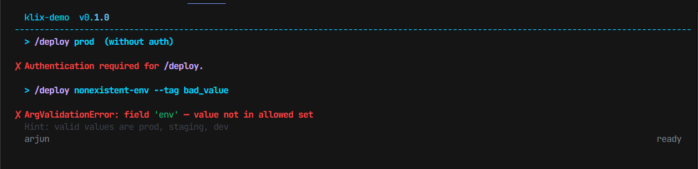

# Handling Events

Events are the lightweight extension points in Klix. They let you hook into the app lifecycle without mixing startup, teardown, and error handling into command bodies.

For the event system itself, see [Events](../concepts/events.md). For the broader runtime flow, see [Architecture](../concepts/architecture.md).

## The Events Klix Uses Today

Current runtime code actively emits:

- `start`
- `input`
- `command`
- `interrupt`
- `error`
- `exit`

The `EventBus` can support any event name, but those are the ones the shipped `App` loop emits out of the box.

## Startup Work

`start` is the right place for initial UI setup.

```python
@app.on("start")
def on_start(session: klix.Session) -> None:
    session.ui.clear()
    session.ui.layout.header.set("OpsTool", color="accent")
    session.ui.layout.status.set("Ready", "Use /help", color="muted")
    session.ui.layout.redraw_ui()
    session.ui.print("Connected to local session.", color="muted")
```

Why not do this in module scope:

- you need a live `Session`
- renderers and input engines are attached at runtime
- startup should happen per session, not once at import time

## Reacting To Raw Input

`input` fires after the prompt returns but before command handling is finished.

```python
@app.on("input")
def count_input(text: str, session: klix.Session) -> None:
    if text.startswith("/"):
        session.state.command_count += 1
```

This is a good hook for:

- telemetry
- input logging
- lightweight counters

It is not a replacement for routing. If you want free-form chat behavior, you still need a custom loop like the one in [Examples: Gemini-Style CLI](../examples/gemini-style-cli.md).

## Watching Commands

`command` fires when a known command is about to execute.

```python
@app.on("command")
def on_command(cmd: klix.ParsedCommand, session: klix.Session) -> None:
    session.ui.print(f"Executing {cmd.name}", color="muted")
```

Use this when you want observation without wrapping execution the way middleware does.

## Handling Interrupts

The app loop catches `KeyboardInterrupt` and emits `interrupt`.

```python
@app.on("interrupt")
def on_interrupt(session: klix.Session) -> None:
    session.ui.print("Interrupted. Type /exit to quit cleanly.", color="warning")
```

This gives you a way to keep the app alive while still acknowledging the interruption.

## Handling Errors

If command execution raises, Klix emits `error` and prints an error line.

```python
@app.on("error")
def on_error(error: Exception, session: klix.Session) -> None:
    session.ui.output.panel(
        str(error),
        title="Command Error",
        border_color="error",
        title_color="error",
    )
```



Keep the handler lightweight. The runtime already caught the exception; your event handler should focus on visibility or cleanup.

## Shutdown Work

`exit` runs at the end of the session loop.

```python
@app.on("exit")
def on_exit(session: klix.Session) -> None:
    session.ui.print("Goodbye.", color="muted")
```

This is the right place for:

- final logging
- summary output
- flushing in-memory results to state

## Sync vs Async Event Listeners

Both are supported:

```python
@app.on("start")
async def async_start(session: klix.Session) -> None:
    await asyncio.sleep(0.1)
    session.ui.print("Async startup completed.", color="success")
```

The event bus preserves listener order and awaits async listeners in sequence.

## Custom Event Names

The `EventBus` can emit arbitrary names. If you want that pattern, do it inside your own app code:

```python
await app._event_bus.emit("sync:finished", result, session)
```

That is useful in advanced apps, but it is not part of the main `App` convenience API. Most projects can stay with the built-in lifecycle events.

## Common Mistakes

- Putting command-specific logic into `start` or `input` handlers.
- Assuming `resize`, `focus`, or `blur` fire automatically. They are named in the event model, but the current runtime does not emit them.
- Doing large blocking work in a sync event listener.
- Forgetting that event listeners run in registration order.

## Related Reading

- [Using Middleware](using-middleware.md)
- [Working With State](working-with-state.md)
- [Reference: Events](../reference/events.md)
